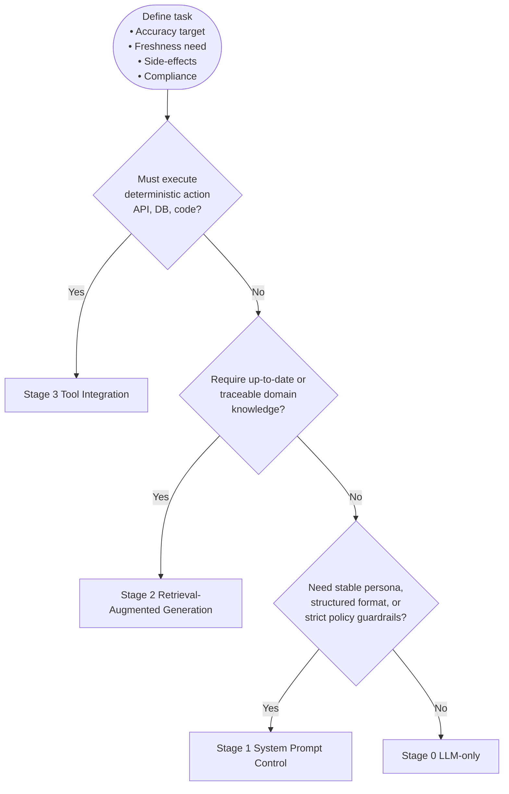

# Use Case Builder Component

A systematic requirements gathering and AI implementation planning interface built with Next.js and AWS Amplify, featuring decision trees, business process analysis, and strategic AI adoption methodologies.

## Overview

The Use Case Builder (`/use-case-builder`) is a comprehensive planning tool that helps users systematically approach AI implementation by:

- **Requirements Gathering**: Structured approach to understanding business needs
- **Decision Tree Framework**: Scientific method for selecting optimal AI layers
- **Business Process Analysis**: Detailed examination of current workflows
- **Strategic Planning**: Methodical approach to AI adoption and implementation
- **Best Practice Guidance**: Proven methodologies and industry standards
- **Visual Process Mapping**: Mermaid diagrams for clear process visualization

## Features

### 🎯 Strategic Planning Framework

- **Four-Stage Architecture**: Systematic approach to AI implementation
- **Decision Tree Logic**: Data-driven selection of minimal sufficient AI layers
- **Requirements Analysis**: Comprehensive business needs assessment
- **Process Optimization**: Identification of improvement opportunities

### 📊 Decision Tree System

The core decision framework helps users select the optimal AI layer:

1. **Stage 0 - LLM-only**: Basic AI capabilities for creative and general tasks
2. **Stage 1 - System Prompt Control**: Structured behavior and persona management
3. **Stage 2 - Retrieval-Augmented Generation**: Knowledge base integration for accuracy
4. **Stage 3 - Tool Integration**: External system integration for actions

### 🔍 Requirements Gathering

- **Business Flow Understanding**: Current process documentation and analysis
- **Issue Identification**: Bottleneck and inefficiency discovery
- **Improvement Collection**: Structured feedback and enhancement planning
- **System Requirements**: Technical and functional specification gathering

### 📈 Use Case Analysis

- **Task Classification**: Systematic categorization of business functions
- **Motivation Mapping**: Understanding underlying business drivers
- **Stage Assignment**: Optimal AI layer selection based on requirements
- **Reasoning Documentation**: Clear rationale for implementation decisions

### 🎨 Visual Process Mapping

- **Mermaid Diagrams**: Professional flow chart generation
- **Interactive Visualizations**: Dynamic process representation
- **Decision Flow**: Clear visualization of decision logic
- **Process Documentation**: Comprehensive workflow mapping

## Architecture

### Decision Tree Logic



### Component Structure

```
UseCaseBuilderPage
├── AppHeader (Global navigation)
├── Main Content Area
│   ├── Introduction Section
│   ├── Decision Tree Visualization
│   ├── Tabbed Interface
│   │   ├── Use Case Analysis
│   │   ├── Motivation Mapping
│   │   └── Requirements Gathering
│   └── Planning Tools
└── Interactive Elements
    ├── Decision Tree Diagram
    ├── Data Tables
    └── Planning Templates
```

## Usage

### Getting Started

1. Navigate to `/use-case-builder`
2. Review the decision tree framework
3. Analyze your specific use case using the provided categories
4. Follow the systematic approach to determine optimal AI layer
5. Use the requirements gathering tools to plan implementation

### Decision Tree Navigation

The decision tree helps select the minimal sufficient AI layer:

**Step 1: External Actions**

- Does your use case require executing deterministic actions?
- Examples: API calls, database operations, file operations
- If Yes → **Stage 3 Tool Integration**

**Step 2: Knowledge Requirements**

- Do you need up-to-date or traceable domain knowledge?
- Examples: Current information, source citations, specific facts
- If Yes → **Stage 2 RAG Integration**

**Step 3: Behavioral Control**

- Do you need stable persona, structured format, or policy guardrails?
- Examples: Consistent responses, JSON output, compliance requirements
- If Yes → **Stage 1 System Prompt Control**

**Default: Stage 0 LLM-only**

- Pure generative tasks that prioritize creativity and flexibility

### Use Case Analysis

Pre-categorized use cases with recommended AI layers:

| Use Case              | Stage | Reasoning                               |
| --------------------- | ----- | --------------------------------------- |
| Search-equivalent Q&A | 2     | Fresh, verifiable knowledge required    |
| Plain text generation | 0     | Emphasizes creativity, tolerates errors |
| Code generation       | 0     | Execution verified by developers        |
| Educational content   | 1     | Stable expression and persona           |
| TODO/scheduling       | 3     | Acts on external systems                |
| Casual conversation   | 1     | Consistent character required           |

### Motivation Mapping

Understanding business drivers for AI implementation:

| Motivation               | Stage | Reasoning                           |
| ------------------------ | ----- | ----------------------------------- |
| Fact acquisition         | 2     | Source required, latest information |
| Productivity improvement | 1     | Structured output, safety           |
| Learning support         | 1     | Explanation consistency             |
| Creative expression      | 0     | Immediate generation                |
| Emotional processing     | 1     | Tone management                     |
| Entertainment            | 0     | Flexibility priority                |

### Requirements Gathering

Systematic approach to business analysis:

#### Current Business Flow Understanding

- Detailed process documentation
- Key personnel identification
- Current tools and systems audit
- Time and effort analysis

#### Issue Identification

- Bottleneck discovery
- Duplicate work elimination
- Error-prone process identification
- Time-consuming task analysis

#### Improvement Request Collection

- Field-based improvement proposals
- Priority item identification
- Ideal workflow visualization
- Expected outcome quantification

#### System Requirements Confirmation

- Functional requirements specification
- Performance criteria definition
- Security requirement assessment
- Integration needs analysis

## Implementation Guidelines

### Stage 0: LLM-only Implementation

**Best For:**

- Creative content generation
- General conversation
- Code generation (with review)
- Translation and summarization

**Implementation:**

- Direct API calls to LLM
- Minimal preprocessing
- Focus on prompt quality
- Human review processes

### Stage 1: System Prompt Control

**Best For:**

- Consistent persona maintenance
- Structured output requirements
- Policy compliance
- Educational content

**Implementation:**

- Carefully crafted system prompts
- Response format specifications
- Behavioral guidelines
- Content filtering rules

### Stage 2: RAG Integration

**Best For:**

- Knowledge-intensive tasks
- Factual accuracy requirements
- Domain-specific expertise
- Traceable information needs

**Implementation:**

- Vector database setup
- Document ingestion pipeline
- Retrieval optimization
- Source attribution

### Stage 3: Tool Integration

**Best For:**

- System integration needs
- External action execution
- Data processing workflows
- Automated task completion

**Implementation:**

- Custom tool development
- API integration setup
- Security considerations
- Error handling protocols

## Planning Templates

### Business Process Analysis Template

```markdown
## Current Process Analysis

### Process Overview

- **Process Name**: [Name of business process]
- **Current Duration**: [Time required]
- **Key Stakeholders**: [People involved]
- **Tools Used**: [Current systems/tools]

### Pain Points

- [Specific bottlenecks]
- [Error-prone steps]
- [Time-consuming activities]
- [Resource inefficiencies]

### Improvement Goals

- [Specific objectives]
- [Success metrics]
- [Timeline expectations]
- [Resource constraints]

### AI Implementation Plan

- **Recommended Stage**: [0/1/2/3]
- **Reasoning**: [Why this stage]
- **Implementation Steps**: [Specific actions]
- **Success Criteria**: [Measurable outcomes]
```

### Requirements Specification Template

```markdown
## AI Implementation Requirements

### Functional Requirements

- [What the AI system must do]
- [Input/output specifications]
- [Performance requirements]
- [Integration needs]

### Non-Functional Requirements

- [Performance benchmarks]
- [Security requirements]
- [Scalability needs]
- [Compliance requirements]

### Technical Requirements

- [Infrastructure needs]
- [Data requirements]
- [API specifications]
- [Monitoring needs]

### Success Metrics

- [Quantitative measures]
- [Quality indicators]
- [User satisfaction metrics]
- [Business impact measures]
```

## Best Practices

### Requirements Gathering

1. **Start with Business Value**: Focus on clear business objectives
2. **Involve Stakeholders**: Include all affected parties in planning
3. **Document Everything**: Maintain comprehensive records
4. **Validate Assumptions**: Test hypotheses before implementation
5. **Plan for Iteration**: Build in feedback loops and improvements

### Decision Making

1. **Use Minimal Sufficient Architecture**: Don't over-engineer solutions
2. **Consider Maintenance**: Plan for long-term system maintenance
3. **Evaluate Trade-offs**: Balance complexity vs. capability
4. **Test Hypotheses**: Validate decisions with pilots
5. **Document Reasoning**: Maintain clear rationale for decisions

### Implementation Planning

1. **Start Small**: Begin with pilot implementations
2. **Measure Success**: Define clear success metrics
3. **Plan for Scale**: Consider growth and expansion
4. **Build in Flexibility**: Allow for future modifications
5. **Document Lessons**: Capture learning for future projects

## Integration with Other Features

### System Prompts Integration

After determining Stage 1 requirements, use the [System Prompts](/prompts) feature to:

- Create custom prompts for specific personas
- Implement behavioral guidelines
- Ensure consistent responses
- Manage prompt versions

### Database Integration

For Stage 2 implementations, use the [Databases](/databases) feature to:

- Upload relevant documents
- Process vector embeddings
- Configure retrieval parameters
- Monitor embedding quality

### Tool Integration

For Stage 3 implementations, use the [Tools](/tools) feature to:

- Develop custom Python functions
- Configure input schemas
- Test tool execution
- Deploy Lambda functions

### Chat Implementation

Apply your planning decisions in the [Chat](/chat) interface by:

- Selecting appropriate AI models
- Applying system prompts
- Enabling relevant databases
- Activating necessary tools

## Performance Considerations

### Planning Efficiency

- **Systematic Approach**: Follow the decision tree consistently
- **Documentation**: Maintain clear requirements documentation
- **Stakeholder Alignment**: Ensure all parties understand decisions
- **Iterative Planning**: Allow for plan refinement based on feedback

### Implementation Success

- **Clear Requirements**: Well-defined functional and non-functional requirements
- **Appropriate Architecture**: Minimal sufficient AI layer selection
- **Measurable Outcomes**: Quantifiable success criteria
- **Continuous Improvement**: Regular review and optimization

## Troubleshooting

### Common Planning Issues

#### Unclear Requirements

- **Problem**: Vague or conflicting business requirements
- **Solution**: Use structured requirements gathering templates
- **Prevention**: Involve all stakeholders in initial planning

#### Over-engineering

- **Problem**: Selecting complex AI layers for simple tasks
- **Solution**: Follow the minimal sufficient architecture principle
- **Prevention**: Validate stage selection against actual needs

#### Scope Creep

- **Problem**: Requirements expanding during implementation
- **Solution**: Maintain clear scope boundaries and change control
- **Prevention**: Detailed upfront planning and stakeholder agreement

### Decision Tree Confusion

#### Multiple Applicable Stages

- **Problem**: Use case seems to fit multiple stages
- **Solution**: Select the minimal sufficient stage that meets requirements
- **Approach**: Start with lower stage and upgrade if needed

#### Unclear Stage Requirements

- **Problem**: Difficulty determining if specific stage features are needed
- **Solution**: Create pilot implementations to test assumptions
- **Approach**: Use iterative approach with feedback collection

## Future Enhancements

### Planned Features

- **Interactive Planning Wizard**: Step-by-step guided implementation planning
- **Template Library**: Pre-built templates for common use cases
- **ROI Calculator**: Business value estimation tools
- **Progress Tracking**: Implementation milestone monitoring
- **Collaboration Tools**: Multi-user planning and review capabilities

### Integration Improvements

- **Automated Recommendations**: AI-powered stage selection assistance
- **Implementation Tracking**: Progress monitoring across all features
- **Success Metrics**: Automated success measurement and reporting
- **Template Generation**: Auto-generated implementation templates

## Contributing

### Development Setup

1. Clone the repository
2. Install dependencies: `npm install`
3. Start development server: `npm run dev`
4. Navigate to `http://localhost:3000/use-case-builder`

### Adding New Features

1. Update component structure in `src/app/use-case-builder/page.tsx`
2. Add new planning templates or decision logic
3. Update this README with new features
4. Test with real use cases

### Code Style

- Follow React and TypeScript best practices
- Maintain clear component structure
- Use meaningful variable names
- Add comprehensive documentation
- Include visual examples where helpful

## License

This component is part of the AINP (AI-Native Platform) application. See the main project LICENSE file for details.
